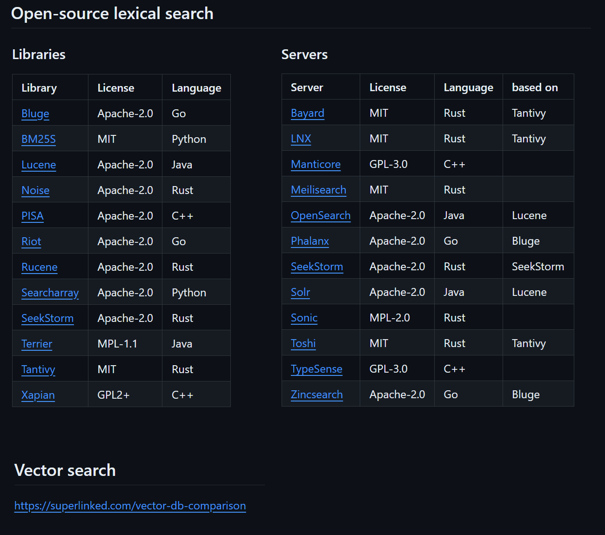

## Open-source lexical search

### Libraries
| Library              | License | Language |
| :---------------- | :------ | :---- |
| [Bluge](https://github.com/blugelabs/bluge) | Apache-2.0 | Go |
| [BM25S](https://github.com/xhluca/bm25s) | MIT | Python |
| [Lucene](https://github.com/apache/lucene) | Apache-2.0 | Java |
| [Noise](https://github.com/pipedown/noise) | Apache-2.0 | Rust |
| [PISA](https://github.com/pisa-engine/pisa) | Apache-2.0 | C++ |
| [Riot](https://github.com/go-ego/riot)| Apache-2.0 | Go |
| [Rucene](https://github.com/zhihu/rucene) | Apache-2.0 | Rust |
| [Searcharray](https://github.com/softwaredoug/searcharray) | Apache-2.0 | Python |
| [SeekStorm](https://github.com/SeekStorm/SeekStorm) | Apache-2.0 | Rust |
| [Terrier](https://github.com/terrier-org/terrier-core) | MPL-1.1 | Java |
| [Tantivy](https://github.com/quickwit-oss/tantivy) | MIT | Rust |
| [Xapian](https://xapian.org/) | GPL2+ | C++ |

### Servers
| Server              | License | Language | based on |
| :---------------- | :------ | :---- | :---- |
| [Bayard](https://github.com/mosuka/bayard) | MIT | Rust | Tantivy|
| [LNX](https://github.com/lnx-search/lnx) | MIT | Rust | Tantivy |
| [Manticore](https://github.com/manticoresoftware/manticoresearch/) | GPL-3.0 | C++ | |
| [Meilisearch](https://github.com/meilisearch/meilisearch) | MIT | Rust | |
| [OpenSearch](https://github.com/opensearch-project/OpenSearch) | Apache-2.0 | Java | Lucene |
| [Phalanx](https://github.com/mosuka/phalanx) | Apache-2.0 | Go | Bluge |
| [SeekStorm](https://github.com/SeekStorm/SeekStorm) | Apache-2.0 | Rust | SeekStorm |
| [Solr](https://github.com/apache/solr) | Apache-2.0 | Java | Lucene | 
| [Sonic](https://github.com/valeriansaliou/sonic) | MPL-2.0 | Rust | |
| [Toshi](https://github.com/toshi-search/Toshi) | MIT | Rust | Tantivy |
| [TypeSense](https://github.com/typesense/typesense) | GPL-3.0 | C++ | |
| [Zincsearch](https://github.com/zincsearch/zincsearch) | Apache-2.0 | Go | Bluge |

## Vector search
https://superlinked.com/vector-db-comparison
